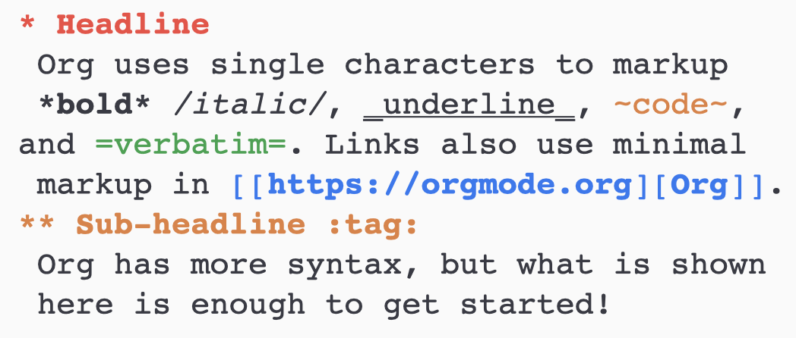
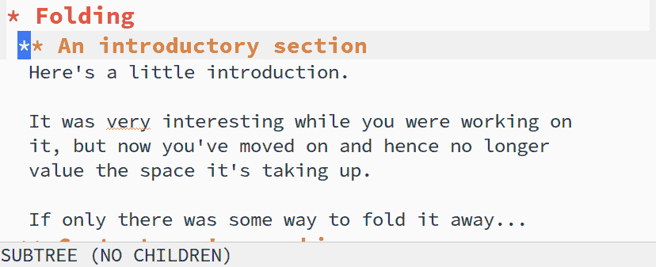
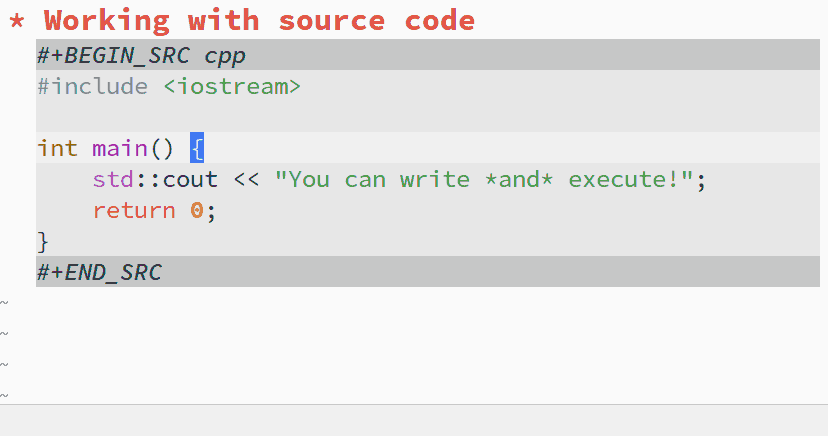

.. _orgmode:

=========
Org-mode
=========

What is Org-mode
-----------------

**Org-mode** is a GNU Emacs `major mode <https://www.gnu.org/software/emacs/manual/html_node/emacs/Major-Modes.html>`__ for keeping notes, doing literate programming, maintaining to-do lists, planning projects and more, just by using an effective plain text syntax.

Having a specific syntax and working on plain text files, on the surface Org-mode can be considered *just* a **markup language**, but being a **major mode** for the Emacs text editor, its features allow much more than only formatting the appearance of a text. Here we'll examine some of them.

Markup basics
~~~~~~~~~~~~~

As **Markdown** and **reStructured Text**, Org's syntax is straightforward and hence classifiable as a **lightweight markup language**. The following is an example of the basic markup.

.. .. code:: 

.. 	* Headline
	Org uses single characters to markup *bold*, /italics/, _underline_, ~code~ and =verbatim=.
	Links also use minimal markup in [[https://orgmode.org][Org]].
	** Sub-headline :tag:
	Org has more syntax, but what is shown here is enough to get started!

Smart editing
~~~~~~~~~~~~~~~

The fundamental structure of an Org document is a tree, with nested, collapsible sections. You can fold and unfold whole trees with a single ``tab`` keystroke.

Org also provides **tags** to let you find your content in a faster and effective way.

Computational notebook
~~~~~~~~~~~~~~~~~~~~~~

Org files can be used also as computational notebooks, providing a complete literate programming environment. `Org babel <https://orgmode.org/worg/org-contrib/babel/languages/index.html>`__ supports a growing number of programming languages. An example of how you can test a snippet of code is the following:

Exportation and publishing
~~~~~~~~~~~~~~~~~~~~~~~~~~

With proper libraries, you can export ``.org`` documents in a series of formats. Some of them are:

*	**HTML**;
*	**LaTeX**;
*	**Markdown**.

Among these, Org only loads libraries for HTML and LaTeX by default. Additional libraries can be loaded in either of two ways: by configuring the org-export-backends variable, or by requiring libraries in the Emacs `init file <https://www.gnu.org/software/emacs/manual/html_node/emacs/Find-Init.html>`__. For example, to load the Markdown back-end, add this to your Emacs config file and restart Emacs:

.. code:: lisp

	(require 'ox-md)

A third-part library to export files in **reStructured Text** can be downloaded `here <https://github.com/msnoigrs/ox-rst>`__.

